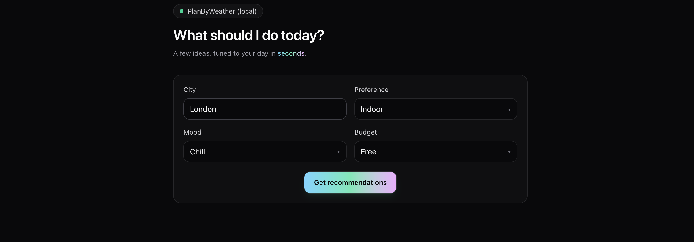
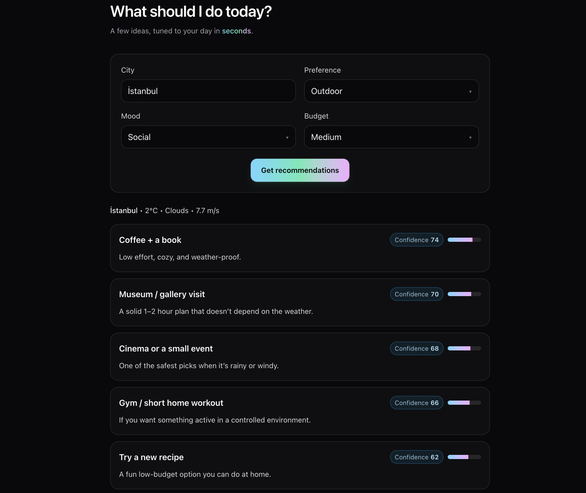

## PlanByWeather

Plan a simple day activity list based on the current weather in a city. You type a city name, hit one button, and get a handful of suggestions with short reasons and a confidence score.

This is an MVP-style project: intentionally small, focused, and easy to run locally.

This repo is optimized for learning and local development: the browser UI stays lightweight, while anything that needs secret keys runs server-side in a Supabase Edge Function.

## What it does

- Enter a city and optional preferences (mood, budget, preference).
- Fetch weather on the server.
- If OpenAI is configured, generate structured recommendations; otherwise return a safe fallback list.
- Render results as clean, readable cards (loading + error states included).

## How it works (high level)

- **Weather data**: A Supabase Edge Function fetches weather for the given city.
- **Rules**: Signals like rain / extreme temp / wind influence the type of suggestions and their confidence.
- **Recommendations (server-side)**: The OpenAI call runs **inside the Edge Function**. The frontend only triggers the request and displays the JSON response.

## Images




Suggested shots to capture:
- Home screen (empty state)
- Loading state
- Error state (e.g. stop the function and click the button)
- Results list

## Local setup

### 1) Prerequisites

- Node.js (for the frontend tooling)
- Docker Desktop (for local Supabase)

### 2) Environment files

The repo uses **two env layers**:

- **Server-side (Edge Function)**: root `.env`
- **Frontend (Vite)**: `web/.env.local`


### 3) Start Supabase locally

Terminal 1 (local stack):

```bash
cd /path/to/planbyweather
npx supabase@latest start
```

Requirement: Docker must be installed and running.

### 4) Serve the Edge Function

```bash
cd /path/to/planbyweather
npx supabase@latest functions serve recommend --env-file .env --no-verify-jwt
```

### 5) Run the frontend

```bash
cd web
npm install
npm run dev
```


## Notes 

- **The Supabase anon key can live in the frontend**: it’s meant for public use (no service role key in this project).
- `.env` is not committed, `.env.example` is: setup stays easy without leaking secrets.

## Product notes

### MVP (5 items)

- City input + “Recommend” button
- Server fetches weather
- Simple rules bias indoor/outdoor
- Server returns recommendations (OpenAI when available; fallback otherwise)
- UI lists cards + loading + error state

### Highest-risk assumptions (2)

- Weather lookup by “city name” will be consistent and reliable.
- The recommendation JSON format will be stable; fallback will cover failures.

### Measurement (2 simple metrics)

- “Recommend” button clicks
- Like/dislike rate on recommendations (to be added)

## Architecture diagram (local)

You added this diagram and notes—kept as-is, just moved under a dedicated section:

```txt
┌─────────────────────────────┐
│           Browser           │
│        (React + Vite)       │
└──────────────┬──────────────┘
               │
               │ supabase.functions.invoke
               ▼
┌─────────────────────────────┐
│           Supabase          │
│        API Gateway          │
│                             │
│        Edge Function        │
│        (recommend)          │
└───────────┬─────────┬───────┘
            │         │
            │         │
            ▼         ▼
┌────────────────┐  ┌────────────────────┐
│  OpenWeather   │  │       OpenAI       │
│      API       │  │   gpt-4.1-mini     │
│ (weather data) │  │ (activity logic)   │
└────────────────┘  └────────────────────┘
            │
            │ combined result
            ▼
┌─────────────────────────────┐
│        JSON Response        │
└──────────────┬──────────────┘
               │
               ▼
┌─────────────────────────────┐
│   UI renders activity cards │
└─────────────────────────────┘


────────────────────────────────────────────────────
 LOCAL DEVELOPMENT ONLY
────────────────────────────────────────────────────

┌──────────────────────────────────────────────┐
│                 Docker                       │
│                                              │
│  Used by:                                    │
│  npx supabase start                          │
│                                              │
│  Runs locally:                               │
│  - Postgres                                  │
│  - Auth                                      │
│  - Edge Functions runtime                    │
└──────────────────────────────────────────────┘

```